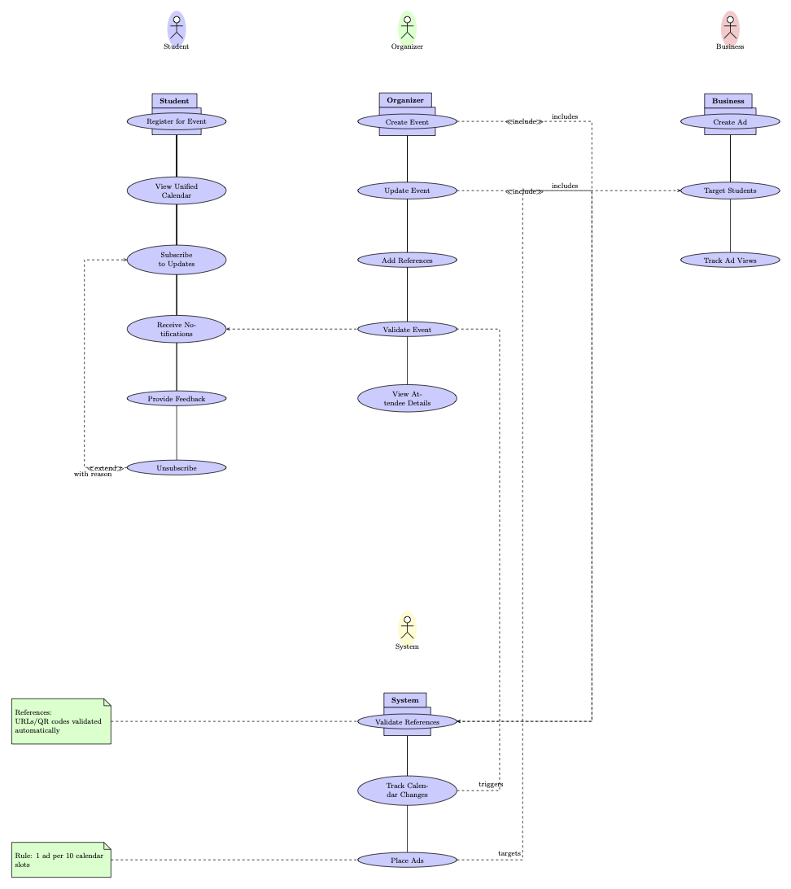
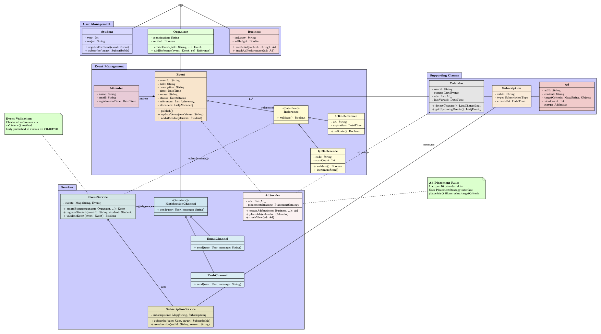

# SparkVibe Activity Hub – Low-Level Design

SparkVibe is a mobile-first hub where college students (ages 18–24) can discover, manage, and register for campus events—from study groups and festivals to personal reminders and sponsored coffee nights. Unlike standalone calendars or noisy social feeds, SparkVibe blends trust (organizer-provided QR/URL validations), engagement (a single unified calendar with change highlights), and community (subscriptions, feedback, comments).

---

## 1. Use Cases at a Glance

Below is a summary of our core actors and what they do:

| Actor       | Key Actions                                                                 |
|-------------|----------------------------------------------------------------------------|
| **Student**   | Browse calendar, RSVP to events, subscribe/unsubscribe, give feedback      |
| **Organizer** | Create/update events, attach validation references, view attendee list    |
| **Business**  | Design & publish targeted ads, track ad views and budget                 |
| **System**    | Validate event references, slot ads (1 per 10 calendar slots), detect updates |



---

## 2. Class Diagram & Core Entities

At the heart of SparkVibe sits a clean, modular class structure. Here are the main models:

```typescript
// Base user with shared properties
class User {
  userId: string;
  name:   string;
  email:  string;
  subscriptions: Subscription[];
  getSubscriptions(): Subscription[];
}

// Specialized roles inherit from User
class Student extends User { year: number; major: string; }
class Organizer extends User { organization: string; verified: boolean; }
class Business  extends User { industry: string; adBudget: number; }

// Event holds references (QR/URL) and a list of attendees
class Event {
  eventId:    string;
  references: Reference[];  
  attendees:  Attendee[];
  publish(): void;
  addAttendee(student: Student): void;
}

// Ads slot into the calendar, respect view-tracking and placement rules
class Ad {
  adId:          string;
  targetCriteria: Map<string, any>;
  viewCount:      number;
  trackView():   void;
}
```



---

## 3. Services & Interfaces

We rely on small, focused services and interfaces to keep logic decoupled and testable:

```typescript
// Handles event creation, registration, and reference validation
class EventService {
  async registerStudent(eventId: string, student: Student): Promise<void> { … }
  validateEvent(event: Event): boolean { … }
}

// Sends notifications via email, push, or future channels (SMS, etc.)
interface NotificationChannel {
  send(user: User, message: string): Promise<void>;
}
class EmailChannel implements NotificationChannel { … }
class PushChannel  implements NotificationChannel { … }

// Manages ad creation, targeting, placement (1 ad per 10 slots), and view tracking
class AdService {
  placeAds(calendar: Calendar): void { … }
  trackView(ad: Ad):   void { … }
}
```

---

## 4. Pseudocode Snippets

### 4.1 Registering for an Event

1. **Fetch** event by ID; ensure it’s `PUBLISHED`.  
2. **Check** for duplicate registration.  
3. **Validate** each `Reference.validate()`.  
4. **Add** student to `event.attendees`.  
5. **Notify** organizer via `NotificationChannel`.

```typescript
async registerStudent(id: string, student: Student) {
  const event = await eventRepo.get(id);
  if (event.status !== 'PUBLISHED') throw new Error('Event not validated');
  if (event.attendees.includes(student)) throw new Error('Already registered');
  
  for (const ref of event.references) {
    const { isValid, details } = await ref.validate();
    if (!isValid) throw new Error(`Invalid reference: ${details}`);
  }

  event.attendees.push(student);
  await notificationService.send(
    event.organizer,
    `${student.name} just RSVP’d to "${event.title}".`
  );
}
```

### 4.2 Ad Placement Logic

- Calculate `maxAds = Math.floor(calendar.events.length / 10)`.  
- Filter all ads by `targetCriteria`.  
- Select up to `maxAds`, assign to `calendar.ads`, and persist.

```typescript
placeAds(calendar: Calendar) {
  const maxAds = Math.floor(calendar.events.length / 10);
  calendar.ads = allAds
    .filter(ad => matchesCriteria(ad, calendar.userInterests))
    .slice(0, maxAds);
}
```

---

## 5. Feature Flow Example

**Event Registration & Notification**

1. **UI**: Student taps “Attend” → frontend calls `/events/:id/register`.  
2. **EventService**:  
   - Checks event state & duplicates  
   - Validates references  
   - Adds attendee  
   - Calls `NotificationService`  
3. **NotificationService** picks the best channel (email/push) and sends confirmation.  
4. **CalendarService** updates the student’s unified calendar with the new event.  

Error cases return appropriate HTTP status codes (403, 409, 503).

---

## 6. Extensibility: Adding Comments

To let students comment on events, we simply introduce:

```typescript
class Comment {
  commentId: string;
  eventId:   string;
  userId:    string;
  text:      string;
}

class CommentService {
  addComment(eventId: string, user: User, text: string): Comment { … }
}
```

No changes to existing `Event` or `User` classes—our design is Open/Closed Principle compliant. Frontend adds two new endpoints:

- **POST** `/events/:id/comments` → `addComment`  
- **GET**  `/events/:id/comments` → `getComments`

---

## 7. Checklist & SOLID Principles

These principles guide our design:

- **Single Responsibility Principle**: Each class or service has one clear responsibility.  
- **Open/Closed Principle**: Components are open for extension but closed for modification.  
- **Liskov Substitution Principle**: Subclasses (e.g., `EmailChannel`, `PushChannel`) can replace their base type (`NotificationChannel`) without affecting correctness.  
- **Interface Segregation Principle**: Clients depend only on interfaces they use (e.g., `NotificationChannel`).  
- **Dependency Inversion Principle**: High-level modules depend on abstractions, not concrete implementations.


